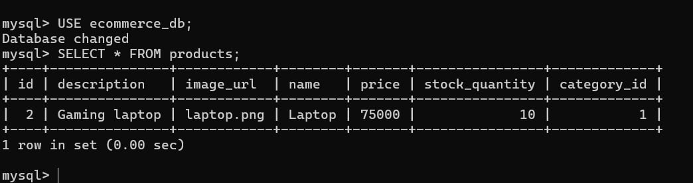
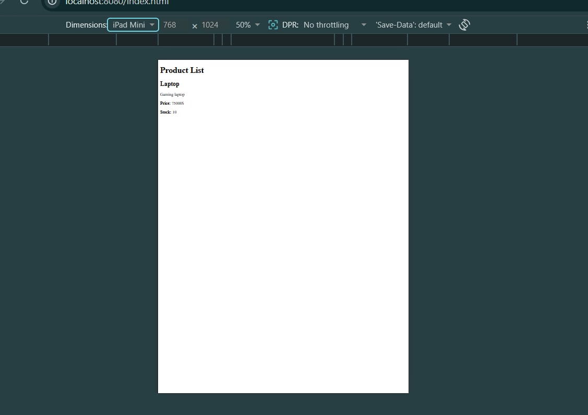

# Ecommerce API (Spring Boot)

## Project Overview

This is a simple RESTful Ecommerce API built using Spring Boot.
It manages products with basic CRUD operations and uses a MySQL database with Spring Data JPA for persistent storage.

Its features include:

* Create, read, update, delete products
* Filter products by category, name, and price
* Input validation
* Global exception handling
* Database persistence using MySQL
* Entity relationships (Category, Product, Order, OrderItem)
* Frontend integration using Fetch API

---

## Setup Instructions

### 1. Requirements

* Java 25+ (I downloaded with Java 26)
* Gradle
* IntelliJ IDEA
* MySQL Server

### 2. Run the application

Open the terminal in the project folder then after opening, run:

```bash
./gradlew bootRun
```

The backend will start at:

```
http://localhost:8080
```

Frontend page:

```
http://localhost:8080/index.html
```

---

## Database Schema

The application uses a MySQL database named `ecommerce_db` to store product and order information.

### Tables

#### 1. products

Stores product details available in the e-commerce system.

Columns:

* id (Primary Key)
* name
* description
* price
* stock_quantity
* image_url
* category_id (Foreign Key referencing categories.id)

Relationship:

* Many Products belong to one Category (Many-to-One)

---

#### 2. categories

Information of store product category

Columns:

* id (Primary Key)
* name

Relationship:

* One Category can have many Products (One-to-Many)

---

#### 3. orders

Stores customer order information.

Columns:

* id (Primary Key)

Relationship:

* One Order can contain multiple OrderItems (One-to-Many)

---

#### 4. order_items

It can store individual product entries within an order.

Columns:

* id (Primary Key)
* order_id (Foreign Key referencing orders.id)
* product_id (Foreign Key referencing products.id)
* quantity

Relationship:

* Many OrderItems belong to one Order
* Many OrderItems reference one Product

## API Endpoints

The following REST API endpoints are available for managing products in ecommerce.  
All endpoints interact with the MySQL database using the Spring Data JPA.

Base URL:

http://localhost:8080/api/v1/products

---

### 1. Get All Products

**GET**

/api/v1/products

Description:
Retrieves a list of all products from the database.

Example Response:

[
{
"id": 1,
"name": "Laptop",
"description": "Gaming laptop",
"price": 75000,
"stockQuantity": 10,
"imageUrl": "laptop.png"
}
]

---

### 2. Get Product by ID

**GET**

/api/v1/products/{id}

Description:
Retrieves a product using the ID.

Example:

/api/v1/products/1

---

### 3. Create Product

**POST**

/api/v1/products

Description:
It can add a new product to the database.

Example Request Body:

{
"name": "Laptop",
"description": "Gaming laptop",
"price": 75000,
"category": {
"id": 1
},
"stockQuantity": 10,
"imageUrl": "laptop.png"
}

---

### 4. Update Product

**PUT**

/api/v1/products/{id}

Description:
Updates an existing product in the database.

Example:

/api/v1/products/1

---

### 5. Delete Product

**DELETE**

/api/v1/products/{id}

Description:
It Removes a product from the database.

Example:

/api/v1/products/1

---

### 6. Filter Products

**GET**

/api/v1/products/filter?filterType=category&filterValue=Electronics

Description:
Filters products based on category, name, or price range.

Supported filters:

category  
name  
price (example: 1000-5000)

## Database Table Screenshot



## Browse Control Screenshot

